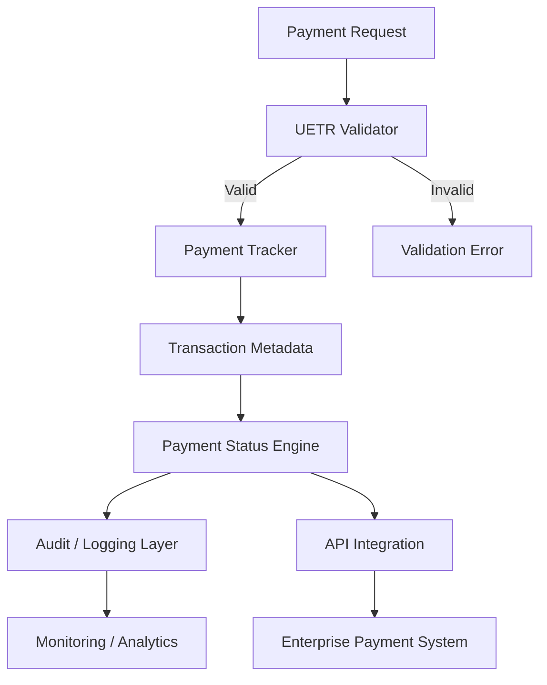

<p align="center">
  
</p>

<h1 align="center">🌐 SWIFT GPI UETR Payment Tracker & Validation Utility</h1>

<p align="center">
  <strong>Enterprise-grade UETR validation, payment tracking, transaction analysis, and financial workflow verification.</strong>
</p>

<p align="center">
  <a href="https://github.com/kongali1720">
    
  </a>
  
  
  
  
  
  
</p>

<p align="center">
  
  
  
  
</p>

---

# 🚀 SWIFT GPI UETR Payment Tracker & Validation Utility

**SWIFT GPI UETR Payment Tracker & Validation Utility** is a developer-focused financial infrastructure utility designed to help engineering, integration, QA, compliance, and fintech teams work with **Unique End-to-End Transaction References (UETRs)** and payment workflow metadata.

The project provides a structured foundation for:

* 🔎 UETR format validation
* 🔄 Payment lifecycle tracking
* 📊 Transaction metadata analysis
* 🧩 Financial workflow verification
* 🔐 Input validation and integrity checks
* 🧪 API and integration testing
* 📡 Payment-status workflow simulation
* 🏦 Enterprise payment infrastructure development

> **Important:** This project is a technical utility for authorized development, testing, integration, and financial workflow verification. It does not provide unauthorized access to SWIFT infrastructure, bank systems, or confidential payment networks.

---

# 🌍 Why UETR Matters

Modern cross-border payment processing requires reliable transaction identification across multiple participants and processing stages.

A **UETR** provides a globally unique reference that can be used as an identifier within supported payment-tracking workflows.

Instead of relying exclusively on:

```text
Transaction ID
Reference Number
Invoice Number
Internal Database ID
```

a UETR-oriented architecture can provide a consistent transaction reference across distributed payment-processing components.

This project explores that concept from an **engineering and infrastructure perspective**.

---

# 🧠 Core Capabilities

| Capability                   | Description                                       |
| ---------------------------- | ------------------------------------------------- |
| 🔎 **UETR Validation**       | Validate UETR structure and input integrity       |
| 🔄 **Payment Tracking**      | Track simulated payment lifecycle states          |
| 📊 **Transaction Analysis**  | Analyze structured payment metadata               |
| 🧩 **Workflow Verification** | Verify expected payment-processing transitions    |
| 🔐 **Validation Layer**      | Reject malformed or inconsistent transaction data |
| 🧪 **Integration Testing**   | Support API and financial workflow testing        |
| 📡 **Status Processing**     | Model payment status progression                  |
| 📝 **Audit-Oriented Data**   | Maintain structured transaction references        |
| ⚙️ **Automation Ready**      | Designed for integration into larger systems      |

---

# 🔄 Payment Lifecycle

A typical payment workflow can be represented as:

```text
┌───────────────┐
│ Payment Init  │
└───────┬───────┘
        │
        ▼
┌───────────────┐
│ UETR Created  │
└───────┬───────┘
        │
        ▼
┌───────────────┐
│ Validation    │
└───────┬───────┘
        │
        ▼
┌───────────────┐
│ Processing    │
└───────┬───────┘
        │
        ▼
┌───────────────┐
│ In Progress   │
└───────┬───────┘
        │
        ├──────────────► Failed
        │
        ▼
┌───────────────┐
│ Completed     │
└───────────────┘
```

The architecture can be adapted to different internal payment-processing environments.

---

# 🏗️ Architecture



---

# 🔐 Validation Pipeline

The validation layer follows a simple principle:

```text
INPUT
  │
  ▼
Normalize
  │
  ▼
Validate UETR
  │
  ▼
Validate Metadata
  │
  ▼
Validate Workflow State
  │
  ▼
Generate Result
  │
  ▼
Audit / Track
```

This separation allows validation logic to remain independent from payment-processing logic.

---

# 📦 Example Transaction Object

```json
{
  "uetr": "xxxxxxxx-xxxx-xxxx-xxxx-xxxxxxxxxxxx",
  "status": "IN_PROGRESS",
  "currency": "USD",
  "amount": 10000.00,
  "origin": "SYSTEM_A",
  "destination": "SYSTEM_B",
  "created_at": "2026-08-15T00:00:00Z"
}
```

The exact transaction schema can be extended according to the requirements of the integrating system.

---

# 📊 Example Payment States

```text
CREATED
   │
   ▼
VALIDATED
   │
   ▼
PROCESSING
   │
   ├──────► FAILED
   │
   ▼
IN_PROGRESS
   │
   ▼
COMPLETED
```

Additional states can be introduced for enterprise reconciliation and exception-management workflows.

---

# 🧪 Testing & Verification

The utility is intended to support controlled environments such as:

* Payment API development
* Fintech application testing
* UETR validation testing
* Transaction workflow simulation
* Reconciliation development
* QA automation
* Integration testing
* Payment-status monitoring
* Internal audit tooling
* Developer education

The project should be used only with transaction data and systems that the operator is authorized to access.

---

# 🛡️ Security Principles

Security is treated as a core design requirement.

```text
ZERO TRUST INPUT
       │
       ▼
VALIDATE
       │
       ▼
SANITIZE
       │
       ▼
PROCESS
       │
       ▼
AUDIT
       │
       ▼
MONITOR
```

Recommended deployment practices include:

* 🔐 Never hard-code credentials
* 🔑 Use environment variables or secret managers
* 🧾 Log transaction identifiers carefully
* 🚫 Never expose confidential payment information
* 🛡️ Apply authentication and authorization at API boundaries
* 🔍 Validate all externally supplied input
* 📊 Maintain appropriate audit trails
* 🔒 Encrypt sensitive data at rest and in transit

---

# ⚙️ Designed for Integration

The utility can serve as a component inside a larger financial infrastructure stack:

```text
                 ┌─────────────────────┐
                 │   Client / Service   │
                 └──────────┬──────────┘
                            │
                            ▼
                 ┌─────────────────────┐
                 │     Payment API     │
                 └──────────┬──────────┘
                            │
                            ▼
                 ┌─────────────────────┐
                 │ UETR Validation     │
                 └──────────┬──────────┘
                            │
                            ▼
                 ┌─────────────────────┐
                 │ Payment Tracker     │
                 └──────────┬──────────┘
                            │
             ┌──────────────┼──────────────┐
             ▼              ▼              ▼
        ┌─────────┐   ┌───────────┐   ┌──────────┐
        │ Audit   │   │ Analytics │   │ Webhook  │
        └─────────┘   └───────────┘   └──────────┘
```

---

# 💡 Use Cases

### 🏦 FinTech

Build payment-processing applications that require structured transaction references and workflow validation.

### 🔌 API Integration

Use the utility as a validation layer between payment APIs and internal systems.

### 🧪 QA & Testing

Generate controlled payment scenarios and verify expected lifecycle transitions.

### 📊 Reconciliation

Use consistent transaction references to correlate payment events across distributed services.

### 🛠️ Developer Tooling

Provide engineers with a lightweight way to validate and inspect payment workflow data during development.

---

# 🌐 Project Ecosystem

| Project                    | Description                                     |   Status  |
| -------------------------- | ----------------------------------------------- | :-------: |
| **KongaliCoin ID**         | Web3 ecosystem and blockchain platform          | 🟢 Active |
| **KongaliCoin**            | ERC-20 smart contract ecosystem                 | 🟢 Active |
| **YOUNEXT Cloud**          | Cloud infrastructure and security platform      | 🟢 Active |
| **ZLCLOTH Industries**     | Enterprise digital solutions                    | 🟢 Active |
| **SWIFT GPI UETR Utility** | Payment reference validation & workflow tooling | 🟢 Active |

---

# 🗂️ Suggested Project Structure

```text
swift-gpi-uetr/
│
├── src/
│   ├── validator/
│   ├── tracker/
│   ├── parser/
│   └── analytics/
│
├── tests/
│   ├── test_uetr.py
│   ├── test_tracker.py
│   └── test_validation.py
│
├── docs/
│   ├── architecture.md
│   ├── api.md
│   └── workflow.md
│
├── examples/
│   └── payment_example.json
│
├── config/
│   └── example.env
│
├── README.md
├── LICENSE
└── requirements.txt
```

---

# 🚀 Development Roadmap

* [x] UETR validation foundation
* [x] Payment workflow concept
* [x] Transaction metadata model
* [ ] Advanced validation rules
* [ ] Payment lifecycle engine
* [ ] REST API
* [ ] Webhook event processing
* [ ] Reconciliation module
* [ ] Audit logging
* [ ] Monitoring dashboard
* [ ] Automated test suite
* [ ] Docker deployment
* [ ] Enterprise deployment documentation

---

# 📈 Project Vision

The long-term goal is to build a modular payment-infrastructure toolkit capable of connecting:

```text
PAYMENT
   ↓
IDENTITY
   ↓
VALIDATION
   ↓
TRACKING
   ↓
RECONCILIATION
   ↓
AUDIT
   ↓
ANALYTICS
```

The project is designed around a simple principle:

> **Every payment event should be identifiable, traceable, verifiable, and auditable.**

---

# ☕ Support the Project

If this project has helped your research, learning, development, or financial-infrastructure engineering work, consider supporting its continued development.

<p align="center">
  <a href="https://www.paypal.com/paypalme/bungtempong99">
    
  </a>
</p>

---

# ⚠️ Disclaimer

This project is intended for **authorized software development, testing, education, integration, and financial workflow verification**.

It does not provide unauthorized access to SWIFT systems, bank infrastructure, payment networks, or confidential financial information.

Users are responsible for ensuring that their implementation and usage comply with applicable laws, regulations, contracts, security policies, and the requirements of their financial institution or payment provider.

---

<p align="center">

<strong>Built for payment infrastructure. Designed for verification. Engineered for traceability.</strong>

<br><br>


</p>
