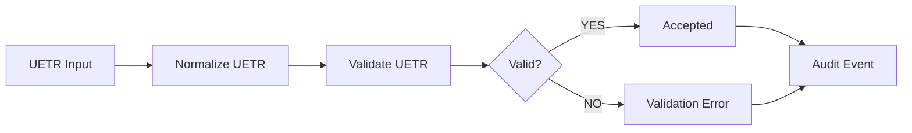
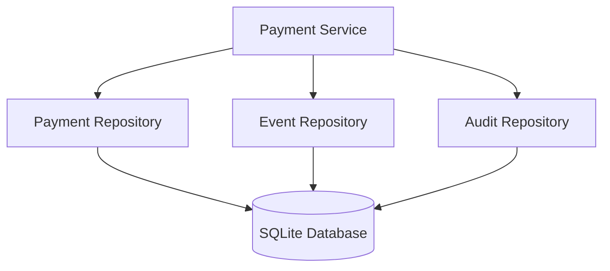
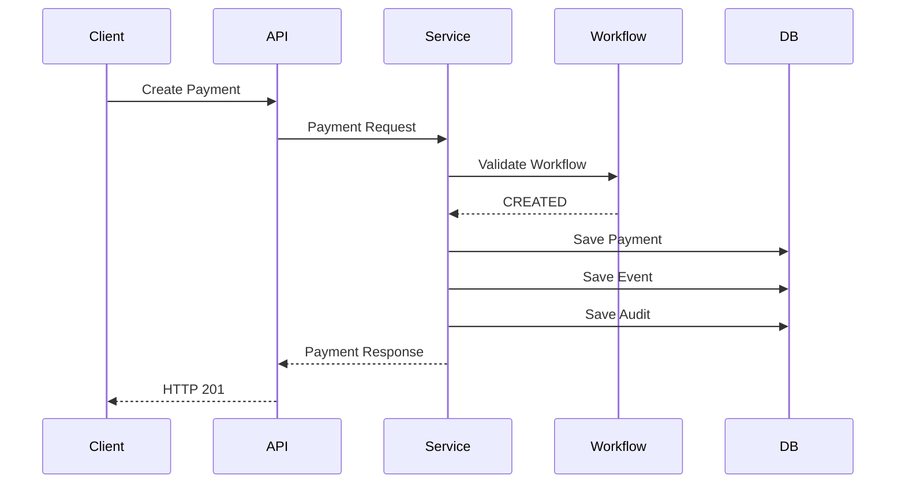
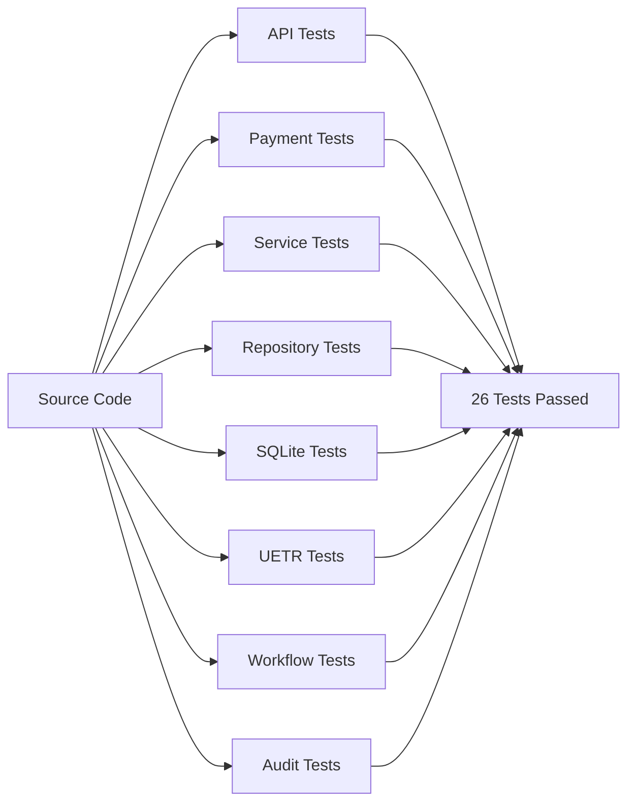
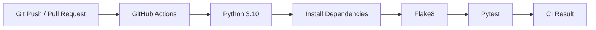
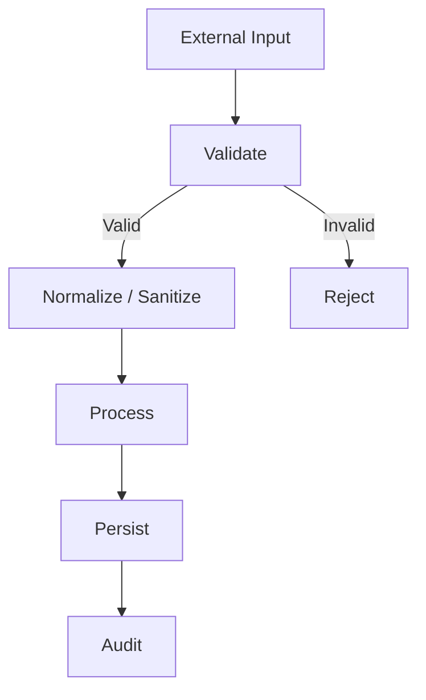
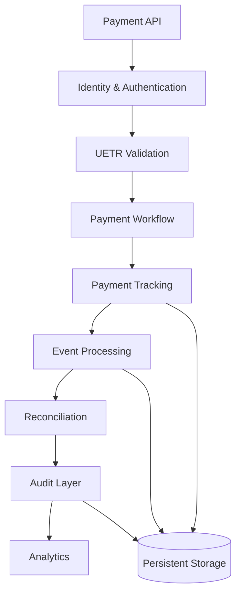

<p align="center">
  
</p>

<h1 align="center">🌐 SWIFT GPI UETR Payment Tracker & Validation Utility</h1>

<p align="center">
  <strong>UETR Validation • Payment Lifecycle Tracking • Workflow Verification • Event Auditing • API Infrastructure</strong>
</p>

<p align="center">
  <a href="https://github.com/kongali1720/SWIFT-GPI-UETR-Payment-Tracker-Validation-Utility">
    
  </a>
  
  
  
  
  
</p>

<p align="center">
  
  
  
  
  
  
</p>

<p align="center">
  <strong>Authorized Development • Testing • Education • Integration • Workflow Verification</strong>
</p>

---

# 🚀 SWIFT GPI UETR Payment Tracker & Validation Utility

**SWIFT GPI UETR Payment Tracker & Validation Utility** is a developer-focused payment infrastructure utility for **UETR validation, payment lifecycle tracking, workflow verification, persistent event tracking, audit logging, transaction analysis, and API-based payment workflow testing**.

The project provides a modular local environment for developers, QA engineers, fintech engineers, payment-infrastructure researchers, and integration teams who need to model and validate payment-processing workflows in a controlled environment.

**Every payment event should be identifiable, traceable, verifiable, and auditable.**

---

# 🌍 Mission

Modern payment systems require reliable transaction correlation across multiple processing stages.

This project models that workflow in a controlled development environment:

```text
PAYMENT REQUEST
      │
      ▼
UETR VALIDATION
      │
      ▼
PAYMENT CREATION
      │
      ▼
WORKFLOW PROCESSING
      │
      ▼
EVENT TRACKING
      │
      ▼
AUDIT RECORDING
      │
      ▼
PERSISTENT STORAGE
      │
      ▼
API RESPONSE
```

# ⚡ Core Capabilities

| Capability                        | Status |
| --------------------------------- | :----: |
| 🔎 UETR Validation                |    ✅   |
| 💳 Payment Creation               |    ✅   |
| 🔄 Payment Lifecycle Tracking     |    ✅   |
| 🧩 Workflow Transition Validation |    ✅   |
| 💾 SQLite Persistence             |    ✅   |
| 📝 Payment Event Tracking         |    ✅   |
| 🔐 Audit Logging                  |    ✅   |
| 📊 Transaction Metadata Analysis  |    ✅   |
| 🚀 FastAPI REST API               |    ✅   |
| 📚 OpenAPI 3.1                    |    ✅   |
| 🧭 Swagger UI                     |    ✅   |
| 📖 ReDoc                          |    ✅   |
| 🧪 Automated Test Suite           |    ✅   |
| 🔄 GitHub Actions CI              |    ✅   |
| 🐍 Python 3.10+                   |    ✅   |

# 🏗️ System Architecture

```mermaid
flowchart TB
    Client["API Client / Developer"]

    API["FastAPI REST API"]

    UETR["UETR Validator"]
    Payment["Payment Service"]
    Workflow["Workflow Engine"]
    Analytics["Transaction Analyzer"]

    PaymentRepo["Payment Repository"]
    EventRepo["Event Repository"]
    AuditRepo["Audit Repository"]

    SQLite[("SQLite Database")]

    Events["Payment Events"]
    Audit["Audit Records"]

    Swagger["Swagger UI"]
    ReDoc["ReDoc"]
    OpenAPI["OpenAPI 3.1"]

    Client --> API

    API --> UETR
    API --> Payment
    API --> Workflow
    API --> Analytics

    UETR --> Payment
    Payment --> Workflow

    Payment --> PaymentRepo
    Workflow --> EventRepo
    Workflow --> AuditRepo

    PaymentRepo --> SQLite
    EventRepo --> SQLite
    AuditRepo --> SQLite

    API --> Swagger
    API --> ReDoc
    API --> OpenAPI

    EventRepo --> Events
    AuditRepo --> Audit
 ```

# 🔄 Payment Lifecycle

```mermaid
stateDiagram-v2

    [*] --> CREATED

    CREATED --> VALIDATED : validation successful
    VALIDATED --> PROCESSING : processing started
    PROCESSING --> IN_PROGRESS : payment processing
    IN_PROGRESS --> COMPLETED : settlement completed

    CREATED --> FAILED : validation failure
    VALIDATED --> FAILED : processing failure
    PROCESSING --> FAILED : processing error
    IN_PROGRESS --> FAILED : settlement failure

    COMPLETED --> [*]
    FAILED --> [*]
```

## Successfull workflow:

```text
CREATED
   │
   ▼
VALIDATED
   │
   ▼
PROCESSING
   │
   ▼
IN_PROGRESS
   │
   ▼
COMPLETED
```

## Example even history:

```text
CREATED      -> VALIDATED    | Validation successful
VALIDATED    -> PROCESSING   | Processing started
PROCESSING   -> IN_PROGRESS  | Payment processing
IN_PROGRESS  -> COMPLETED    | Settlement completed
```

### Invalid state transitions are rejected by the workflow engine.

# 🔎 UETR Validation Floww



# 🧩 Service Architecture

```text
src/
│
├── api/
│   └── FastAPI application layer
│
├── analytics/
│   └── transaction analysis
│
├── audit/
│   └── audit record handling
│
├── database/
│   └── SQLite infrastructure
│
├── parser/
│   └── transaction parsing
│
├── repository/
│   ├── payment repository
│   ├── SQLite payment repository
│   ├── SQLite event repository
│   └── SQLite audit repository
│
├── services/
│   └── payment service
│
├── tracker/
│   ├── payment tracking
│   └── workflow engine
│
└── validator/
    └── UETR validation
```

# Rest API

```bash
http://127.0.0.1:8080
```

| Method | Endpoint | Description |
|:---:|---|---|
| `GET` | `/health` | Service health and persistence status |
| `POST` | `/api/v1/uetr/validate` | Validate a UETR |
| `POST` | `/api/v1/payments` | Create a payment |
| `GET` | `/api/v1/payments` | List payments |
| `GET` | `/api/v1/payments/{uetr}` | Retrieve payment by UETR |
| `POST` | `/api/v1/payments/{uetr}/status` | Update payment status |
| `GET` | `/api/v1/payments/{uetr}/events` | Retrieve payment events |

# 📚 OpenAPI Documentation

Interactive API documentation is automatically generated by FastAPI.

## 🧭 Swagger UI

```text
http://127.0.0.1:8080/docs
```

## 📖 ReDoc

```text
http://127.0.0.1:8080/redoc
```

## 📄 OpenAPI Specification

```text
http://127.0.0.1:8080/openapi.json
```

## 📘 API Documentation

```text
docs/API.md
```

---

# 💳 Create Payment

```bash
curl -X POST \
  http://127.0.0.1:8080/api/v1/payments \
  -H "Content-Type: application/json" \
  -d '{
    "uetr": "550e8400-e29b-41d4-a716-446655440001",
    "amount": 10000.0,
    "currency": "USD",
    "origin": "SYSTEM_A",
    "destination": "SYSTEM_B"
  }'
```

---

# 🔎 Validate UETR

```bash
curl -X POST \
  http://127.0.0.1:8080/api/v1/uetr/validate \
  -H "Content-Type: application/json" \
  -d '{
    "uetr": "550e8400-e29b-41d4-a716-446655440001"
  }'
```

---

# ❤️ Health Check

```bash
curl http://127.0.0.1:8080/health
```

## Example Response

```json
{
  "status": "healthy",
  "service": "swift-gpi-uetr",
  "version": "1.1.0",
  "environment": "authorized-development-testing",
  "persistence": "sqlite"
}
```

---

# 💾 Persistent Storage

SQLite provides local persistence for payment data, workflow events, and audit records.



## 📦 Stored Information

```text
Payments
Payment Events
Workflow Events
Audit Records
```

> Runtime database files should remain outside version control.

---

# 📝 Event & Audit Tracking



## 🔗 Correlation Model

```text
UETR
 │
 ├── Payment
 │
 ├── Status
 │
 ├── Events
 │
 └── Audit Records
```

---

# 🧪 Automated Testing

The automated test suite covers:

```text
API
Audit
Payment
Payment Service
Repository
SQLite Persistence
UETR Validation
Workflow
```

## ▶️ Run Tests

```bash
PYTEST_DISABLE_PLUGIN_AUTOLOAD=1 python -m pytest -v
```

## ✅ Current Verification

```text
26 passed
```

## 🏗️ Test Architecture



---

# 🔄 Continuous Integration

GitHub Actions automatically validates the project.



## 🔁 CI Triggers

```text
push → main
pull_request → main
```

---

# 🛡️ Security Principles

The architecture follows a validation-first model.



## 🔐 Recommended Practices

* 🔑 Never hard-code credentials
* 🌱 Use environment variables for secrets and configuration
* 🛡️ Validate all external input
* 🔒 Protect sensitive transaction information
* 👤 Apply authentication and authorization at production boundaries
* 📝 Maintain appropriate audit trails
* 🧪 Use authorized test data only

# 📦 Project Structure

```text
swift-gpi-uetr/
│
├── .github/
│   └── workflows/
│       └── python-app.yml
│
├── config/
│   └── settings.py
│
├── docs/
│   └── API.md
│
├── examples/
│   └── payment_example.json
│
├── src/
│   ├── api/
│   │   ├── __init__.py
│   │   └── app.py
│   │
│   ├── analytics/
│   │   ├── __init__.py
│   │   └── analyzer.py
│   │
│   ├── audit/
│   │   ├── __init__.py
│   │   └── audit_log.py
│   │
│   ├── database/
│   │   ├── __init__.py
│   │   └── sqlite.py
│   │
│   ├── parser/
│   │   ├── __init__.py
│   │   └── transaction.py
│   │
│   ├── repository/
│   │   ├── payment_repository.py
│   │   ├── sqlite_payment_repository.py
│   │   ├── sqlite_event_repository.py
│   │   └── sqlite_audit_repository.py
│   │
│   ├── services/
│   │   ├── __init__.py
│   │   └── payment_service.py
│   │
│   ├── tracker/
│   │   ├── payment.py
│   │   └── workflow.py
│   │
│   └── validator/
│       ├── __init__.py
│       └── uetr.py
│
├── tests/
│   ├── test_api.py
│   ├── test_audit.py
│   ├── test_payment.py
│   ├── test_payment_service.py
│   ├── test_repository.py
│   ├── test_sqlite_audit.py
│   ├── test_sqlite_events.py
│   ├── test_uetr.py
│   └── test_workflow.py
│
├── .env.example
├── .gitignore
├── README.md
├── requirements.txt
└── LICENSE
```

# 🎯 Intended Use

### 🏦 FinTech Development

Modeling and testing payment workflow infrastructure.

### 🔌 API Integration

Developing and validating payment API integrations.

### 🧪 QA & Automated Testing

Testing payment lifecycle behavior and workflow transitions.

### 📊 Transaction Analysis

Analyzing transaction metadata and payment events.

### 📝 Audit Engineering

Developing structured event and audit mechanisms.

### 🧑‍💻 Developer Education

Learning payment infrastructure architecture and API engineering.

---

# 🌐 Project Ecosystem

| Project                    | Description                                       |   Status  |
| -------------------------- | ------------------------------------------------- | :-------: |
| **KongaliCoin ID**         | Web3 ecosystem and blockchain platform            | 🟢 Active |
| **KongaliCoin**            | ERC-20 smart contract ecosystem                   | 🟢 Active |
| **YOUNEXT Cloud**          | Cloud infrastructure and security platform        | 🟢 Active |
| **ZLCLOTH Industries**     | Enterprise digital solutions                      | 🟢 Active |
| **SWIFT GPI UETR Utility** | Payment reference validation and workflow tooling | 🟢 Active |

---

# 🗺️ Roadmap

## 🧱 Foundation

* [x] UETR validation
* [x] Payment metadata model
* [x] Payment lifecycle engine
* [x] Workflow transition validation
* [x] Transaction analysis foundation

## 💾 Persistence

* [x] SQLite database
* [x] Payment repository
* [x] Event repository
* [x] Audit repository
* [x] Persistent payment service

## 🚀 API

* [x] FastAPI REST API
* [x] UETR validation endpoint
* [x] Payment creation
* [x] Payment listing
* [x] Payment lookup
* [x] Payment status update
* [x] Payment events
* [x] Health endpoint
* [x] OpenAPI 3.1
* [x] Swagger UI
* [x] ReDoc
* [x] API documentation

## 🧪 Quality

* [x] Automated tests
* [x] API tests
* [x] SQLite persistence tests
* [x] Workflow tests
* [x] Audit tests
* [x] Repository tests
* [x] GitHub Actions CI

## 🚀 Next Generation

* [ ] Standardized API response models
* [ ] Standardized error schema
* [ ] Request ID / correlation ID
* [ ] Authentication / authorization
* [ ] Rate limiting
* [ ] Structured logging
* [ ] Metrics and observability
* [ ] Webhook event processing
* [ ] Reconciliation module
* [ ] Docker deployment
* [ ] Production deployment documentation

# 📈 Future Architecture



# ⚠️ Scope & Authorization

This project is strictly intended for:

```text
AUTHORIZED
DEVELOPMENT
TESTING
EDUCATION
INTEGRATION
WORKFLOW VERIFICATION
```

This project does **not** provide:

```text
SWIFT NETWORK ACCESS
BANK ACCOUNT ACCESS
REAL PAYMENT EXECUTION
CORRESPONDENT BANKING ACCESS
PAYMENT SETTLEMENT
UNAUTHORIZED FINANCIAL ACCESS
```

This is an independent local development and testing utility. It does **not** connect to SWIFT infrastructure, banking systems, correspondent banking networks, or external financial networks.

Users are responsible for ensuring that their implementation complies with applicable laws, regulations, contracts, security policies, and institutional requirements.

> ⚠️ **Important:** Use this project only with systems, credentials, data, and infrastructure that you are authorized to access and test.
>
> # ☕ Support the Project

If this project has helped your research, learning, development, or payment-infrastructure engineering work, consider supporting its continued development.

<p align="center">
  <a href="https://www.paypal.com/paypalme/bungtempong99">
    
  </a>
</p>

---

# 🏆 Engineering Philosophy

```text
DREAM FAST.
BUILD FAST.
VERIFY EVERY MILESTONE.
```

```text
DESIGN
   ↓
IMPLEMENT
   ↓
TEST
   ↓
VERIFY
   ↓
DOCUMENT
   ↓
SHIP
```

---

<p align="center">
  <strong>Built for payment infrastructure.</strong>
  <br>
  <strong>Designed for verification.</strong>
  <br>
  <strong>Engineered for traceability.</strong>
</p>

<p align="center">
  
</p>

<p align="center">
  <sub>
    SWIFT and SWIFT GPI are trademarks of their respective owners.
    This project is an independent development and testing utility
    and is not affiliated with or endorsed by SWIFT.
  </sub>
</p>


